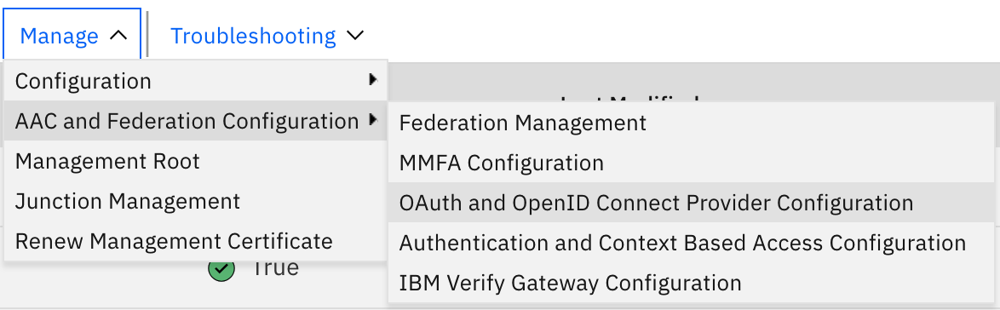
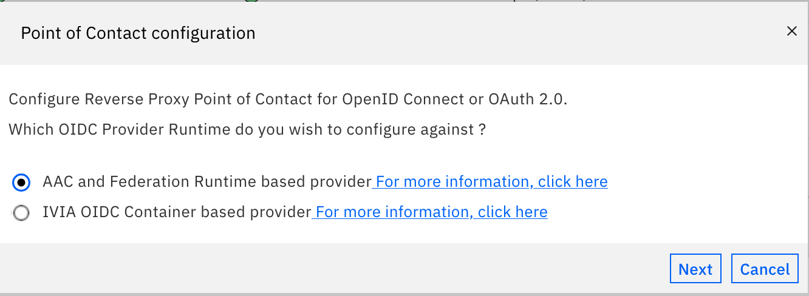
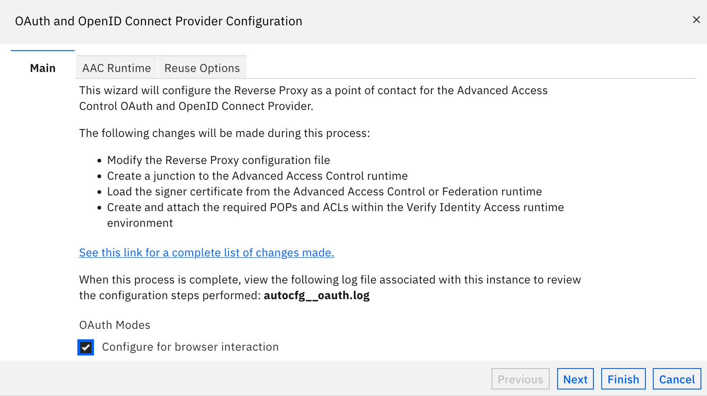
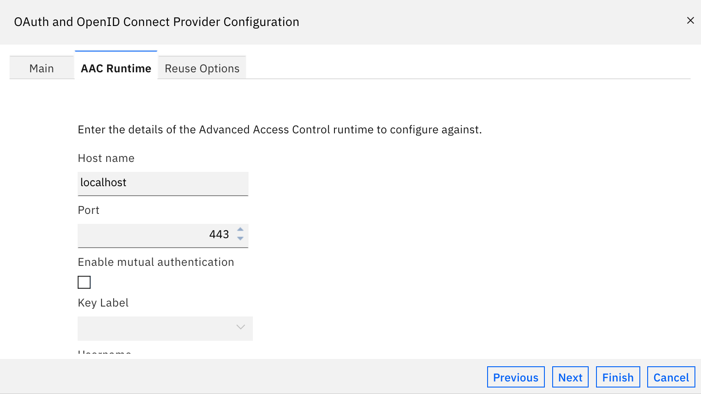
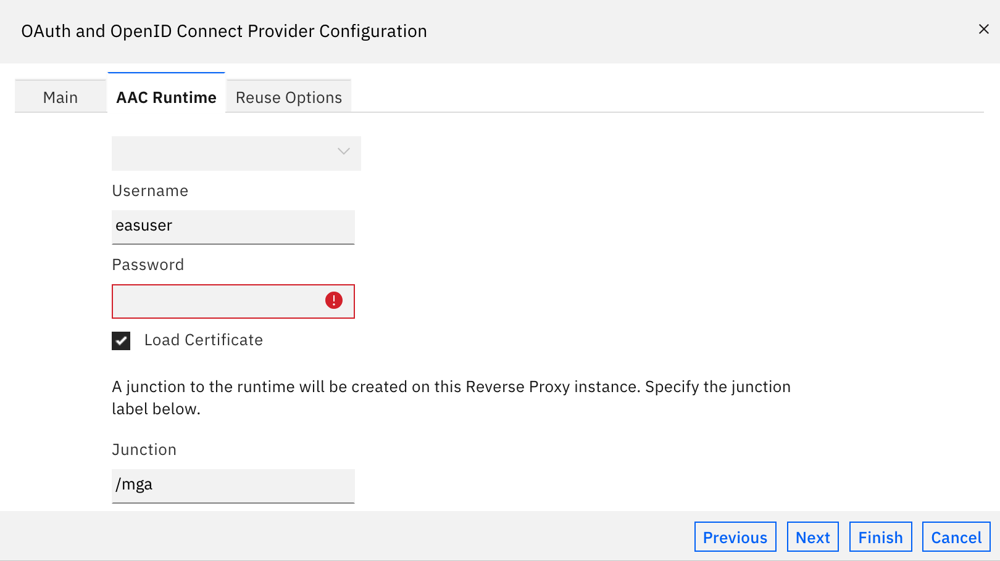
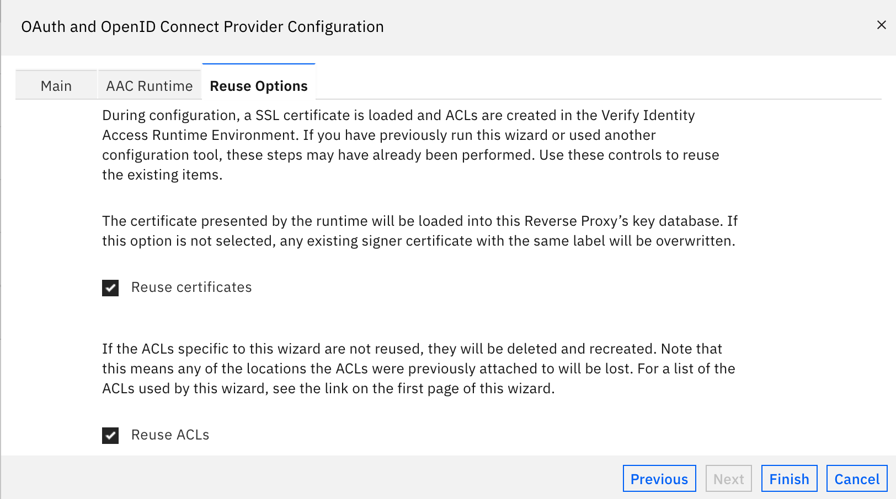
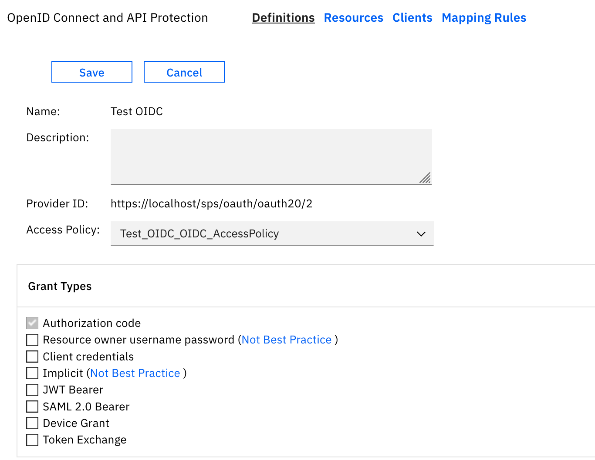
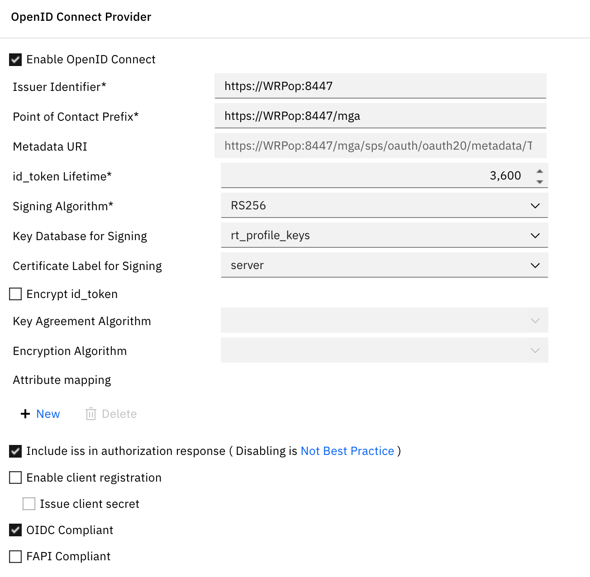
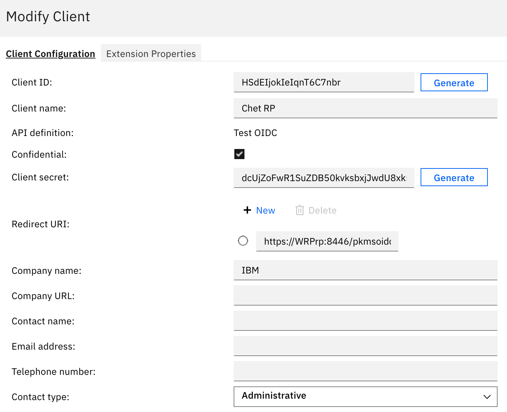
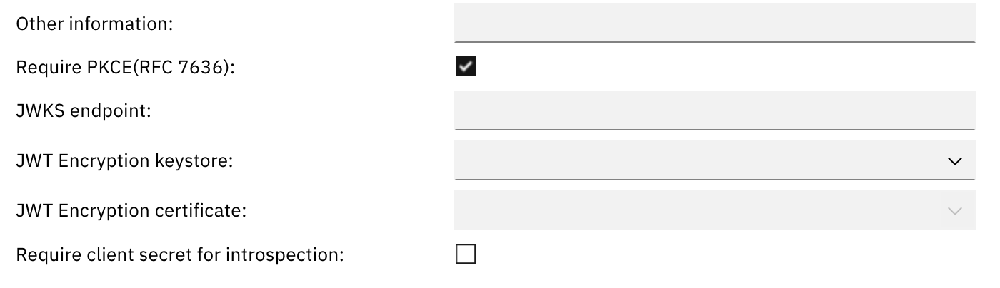

# Setting Up the OP

This is done once, on the reverse proxy instance that will act as the OIDC
Provider (`webseal-op` in this guide). Don't run this wizard against an RP
instance — see [05-topology.md](05-topology.md) for why OP and RP need to
be separate instances in the first place.

## 1. Run the OAuth and OpenID Connect Provider Configuration wizard

**Manage → AAC and Federation Configuration → OAuth and OpenID Connect
Provider Configuration**

### Point of Contact configuration

Choose **AAC and Federation Runtime based provider**.

*(The alternative, IVIA OIDC Container based provider, is a separate
deployment model not covered by this guide.)*

### Main tab

Under **OAuth Modes**, select only:

- [x] **Configure for browser interaction**

Leave **Configure for API Protection** unchecked — that's for bearer-token
API access, not the browser-based login flow this guide covers.

### AAC Runtime tab

This is the connection to the AAC runtime backend. In this guide's lab
environment, AAC runs on the same appliance as the reverse proxy, so the
defaults are used unchanged:

- **Host name:** `localhost`
- **Port:** `443`
- **Enable mutual authentication:** unchecked

**If your AAC runtime lives on a different system** (a separate appliance
or a standalone AAC deployment), set **Host name** and **Port** to that
system's actual address instead of `localhost` — this field is simply
telling the reverse proxy where to reach the runtime, wherever it happens
to run. Every reverse proxy instance that needs the runtime (the OP, and
in some deployments additional instances) points at the same runtime
address here, regardless of how many reverse proxy instances there are.

Scroll down for the runtime admin credentials and the junction to create:

- **Username / Password:** your AAC runtime admin credentials
- **Load Certificate:** checked
- **Junction:** `/mga`

### Reuse Options tab

Leave both checked (defaults):

- [x] **Reuse certificates**
- [x] **Reuse ACLs**

Click **Finish**.

## 2. Create the OpenID Connect and API Protection definition

**Manage → AAC and Federation Configuration → Global Settings → API
Protection → Definitions → New**, or via the OIDC/API Protection
management screen.

### Grant Types

Select only:

- [x] **Authorization code**

Leave every other grant type unchecked — Authorization Code is the only
one this guide's browser-login flow needs.

### OpenID Connect Provider section

- [x] **Enable OpenID Connect**
- **Issuer Identifier:** `https://<op-hostname>:<port>` — e.g.
  `https://webseal-op.example.com:8447`
- **Point of Contact Prefix:** `https://<op-hostname>:<port>/mga`
- **Signing Algorithm:** `RS256`
- **Key Database for Signing / Certificate Label for Signing:** your
  signing cert
- [x] **Include iss in authorization response**
- [ ] **Enable client registration** (leave unchecked — clients are
  registered manually, see below)
- [x] **OIDC Compliant**
- [ ] **FAPI Compliant** (leave unchecked unless you have a specific
  FAPI/regulatory requirement)

**Issuer Identifier vs. Point of Contact Prefix:** these look similar but
serve different purposes. Issuer Identifier is the `iss` claim value
embedded in every token. Point of Contact Prefix is what the runtime
actually uses to build the published `authorization_endpoint`,
`token_endpoint`, etc. in the discovery metadata — this is the value that
determines where browsers actually get sent. Both should point at the OP's
hostname.

## 3. Register a client for each RP

**OpenID Connect and API Protection → Clients → New**, once per RP.

- **Client name:** a name identifying the RP (e.g. `webseal-rp1`)
- **API definition:** the definition created above
- **Confidential:** checked
- **Client secret:** generate one — this needs to match the RP's
  `[oidc:default]` `client-secret`
- **Redirect URI:** `https://<rp-hostname>:<port>/pkmsoidc` — must match
  the RP's `redirect-uri-host` exactly, byte-for-byte
- **Require PKCE (RFC 7636):** checked

Repeat this step for each additional RP — one client registration per RP,
each with its own client ID/secret and its own Redirect URI.

Next: [04-rp-setup.md](04-rp-setup.md) — configuring each RP instance.
