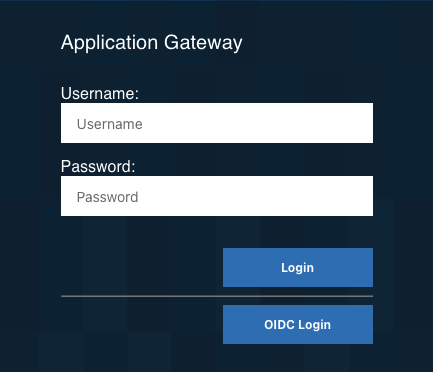

# Setting Up an RP

Repeat this section once per application domain that previously
participated in CDSSO — each becomes its own RP, on its own reverse proxy
instance (`webseal-rp1`, `webseal-rp2`, etc.).

## No wizard needed

Unlike the OP, an RP instance doesn't run the OAuth and OpenID Connect
Provider Configuration wizard, doesn't get its own `/mga` junction, and
doesn't talk to the AAC runtime directly. An RP is pure client-side
configuration: a stanza in `webseald.conf`, plus a client registration on
the OP (see [03-op-setup.md](03-op-setup.md)).

## Prerequisite: trust the OP's certificate

Each RP makes its own outbound TLS connection to the OP — to fetch the
discovery document, and later to perform the token exchange. Before
configuring `[oidc]`, confirm the OP's CA (or server certificate, if
self-signed) is loaded into **this RP instance's** SSL key database. In
most deployments the OP's certificate is already signed by a CA every RP
already trusts; this is mainly a concern in lab/test environments using
self-signed certificates, where it's easy to skip and the resulting
failure is silent rather than an obvious error (see
[06-troubleshooting.md](06-troubleshooting.md)).

## The `[oidc]` / `[oidc:default]` stanza

Add to `webseald.conf`:

```
[oidc]
oidc-auth = https
default-op = default

[oidc:default]
redirect-uri-host = <rp-hostname>:<port>
discovery-endpoint = https://<op-hostname>:<port>/mga/sps/oauth/oauth20/metadata/<definition-name>
client-id = <client ID from the OP registration>
client-secret = <client secret from the OP registration>
response-type = code
enable-pkce = yes
response-mode = query
scopes =
mapped-identity = {iss}/{sub}
external-user = true
```

Field notes:

- **`redirect-uri-host`** is host and port only — no scheme (`https://`),
  no path (`/pkmsoidc`). WebSEAL builds the final redirect URI as
  `https://<redirect-uri-host>/pkmsoidc` automatically. This value must
  produce the exact same string as the Redirect URI registered on the
  client at the OP.
- **`discovery-endpoint`** — if the definition name contains spaces, they
  must appear URL-encoded (`%20`) in this value, matching how the
  metadata endpoint is actually published.
- **`client-secret`** gets obfuscated and moved to the bottom of the
  stanza automatically after the reverse proxy is restarted — if you go
  looking for it later, check the end of the stanza, not just where you
  originally typed it.
- **`enable-pkce`** must match whatever the client's **Require PKCE**
  setting is on the OP side — both on, or both off.

Restart the reverse proxy instance after saving. No `login.html` changes
are needed — the default login page's OIDC Login button works as-is:



## Linking to a protected resource from another application

This is the direct replacement for the old `/pkmscdsso?<target-url>` link
— and it's simpler than the CDSSO equivalent. Link straight to the
protected resource itself, not to `/pkmsoidc`:

```html
<a href="https://<rp-hostname>:<port>/some-protected-page">
  Go to application
</a>
```

An unauthenticated user hitting that link triggers WebSEAL's normal login
challenge (showing the OIDC Login button, among any other configured
methods). Once authenticated, WebSEAL's own pending-request tracking sends
them back to the page they originally asked for — no `/pkmsoidc` link,
`Target` parameter, or `login.html` customization needed to make that
happen.

### Why a `/pkmsoidc?Target=...` kickoff link doesn't work

It's tempting to build a direct kickoff link instead — something like
`/pkmsoidc?iss=default&Target=/some-protected-page` — mirroring the old
`/pkmscdsso?<target-url>` pattern. This looks like it should work (and the
`Target` parameter really does get forwarded all the way to the OP's
`/authorize` request), but WebSEAL never uses it to redirect the browser
back afterward. The user ends up on a generic "login successful" page
instead of the resource they wanted.

This isn't a bug or a missing config setting — it's confirmed, documented
behavior. IBM engineer Scott A. Exton explained it in an
[IBM Community thread](https://community.ibm.com/community/user/discussion/pkmsoidc-and-trimmed-referer):

> WebSEAL, when acting as a OIDC relying party, does not rely on the
> referrer header at all. WebSEAL will store the originally requested URL
> (i.e. the URL which triggered the authentication flow) in the session.

In other words, the "land back on the original resource" behavior is tied
to WebSEAL's own session state from an actual unauthenticated challenge on
the real protected resource — not to a `Target` query parameter on a
constructed link. A `/pkmsoidc` link has no such session to draw from, so
there's nothing for it to send the user back to. Linking directly to the
protected resource (above) is therefore not just the simpler option — it's
the only pattern that reliably lands the user where they intended to go.

### What `/pkmsoidc` is actually for

It's worth understanding why the endpoint behaves this way, rather than
treating it as an arbitrary limitation. `/pkmsoidc` is the OAuth
**redirect_uri** — the fixed callback the OP sends the user back to with
an authorization code after they authenticate. That's its one required
job, and every RP needs it regardless of how the flow started.

It also does double duty as the target of the login page's own OIDC Login
button — but notice what that button actually submits: `iss` and a
session-index `token`, not a destination. It's using `/pkmsoidc` as a
handle back into the pending-request state WebSEAL already stored in
session from the original challenge, not as a general "log in and go
here" endpoint.

That also explains why it doesn't accept an arbitrary destination from a
caller: if `/pkmsoidc` honored a `Target` (or similar) parameter supplied
by whoever constructs the link, that would be an open-redirect pattern
sitting on the authentication callback itself — anyone could craft a link
redirecting through your RP to an arbitrary external URL. OAuth's
redirect_uri model is deliberately fixed and pre-registered for this
reason. CDSSO's `/pkmscdsso?<target>` could take a target directly because
it was a peer-to-peer trust model with different assumptions; that pattern
doesn't carry forward to OIDC.

Practical takeaway: use `/pkmsoidc` only as the registered callback and as
what the login page's own button calls — not as a link for other
applications to construct. For that, link to the protected resource
directly, as shown above.

Next: [05-topology.md](05-topology.md) — why OP and RP need to run on
separate reverse proxy instances.
