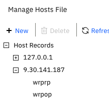

# Topology: Why OP and RP Need Separate Reverse Proxy Instances

**The OP and every RP must run on separate Web Reverse Proxy instances —
even in the simplest deployment with only one application.** This is the
single most important decision in the whole setup, and it's easy to get
wrong if you start from "let's keep this simple" and put OP and RP on one
instance with a single hostname.

## The topology

```
                 ┌──────────────┐
                 │  webseal-op  │   ← OIDC Provider
                 │ (own hostname│      one shared AAC runtime behind it
                 │  & junction) │
                 └──────┬───────┘
                         │
        ┌────────────────┼────────────────┐
        │                │                │
┌───────▼──────┐ ┌───────▼──────┐ ┌───────▼──────┐
│ webseal-rp1  │ │ webseal-rp2  │ │ webseal-rp3  │   ← one RP per
│ (own hostname│ │ (own hostname│ │ (own hostname│      application domain
│  & app)      │ │  & app)      │ │  & app)      │      that used CDSSO
└──────────────┘ └──────────────┘ └──────────────┘
```

One OP, shared by every RP. Each RP is its own reverse proxy instance,
with its own hostname, protecting its own application — the same shape
CDSSO had, just with a hub instead of peer-to-peer trust.

## Why a shared instance doesn't work

Session cookies are scoped to a hostname, not to a role. If the OP and an
RP share the same reverse proxy instance and hostname, they also share a
cookie jar in the browser — and the login flow needs two *different*
cookies to coexist at the same time:

1. The RP's cookie, tracking "a login is in progress, waiting for the
   callback"
2. The OP's cookie, set when the user authenticates at the OP's own login
   challenge

If both are the same hostname, step 2's cookie **overwrites** step 1's —
not adds to it. By the time the flow loops back to the RP's callback
(`/pkmsoidc`), the session it's looking for has been silently replaced.
The result is a token/session correlation failure at the RP's callback,
well downstream of the actual cause, which makes this genuinely hard to
diagnose from symptoms alone. (See
[06-troubleshooting.md](06-troubleshooting.md) for what this actually
looks like in a trace, if you're debugging an existing single-instance
setup.)

In this lab, the OP and RP were given separate hostnames (`wrpop` and
`wrprp`) resolving to the same underlying IP, added as host entries on the
client machine for testing:



Simply giving the OP and RP two different *hostnames* on the *same*
reverse proxy instance doesn't fix this either — the underlying object
space and routing are still shared underneath, and the login challenge
ends up resolving through the RP's identity regardless of which hostname
initiated the flow. The separation has to be at the reverse proxy
**instance** level, not just at the DNS/hostname level.

## What this means for multi-domain CDSSO replacements

If your CDSSO deployment had three application domains talking to each
other, the OIDC replacement is: one `webseal-op` instance, plus three RP
instances (`webseal-rp1`, `webseal-rp2`, `webseal-rp3`), each with its own
hostname and its own client registration on the OP. All three RPs share
the same AAC runtime behind the OP — you don't need a separate runtime per
RP, just a separate reverse proxy instance.

Next: [06-troubleshooting.md](06-troubleshooting.md).
