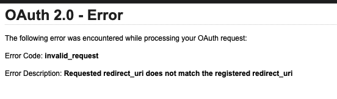
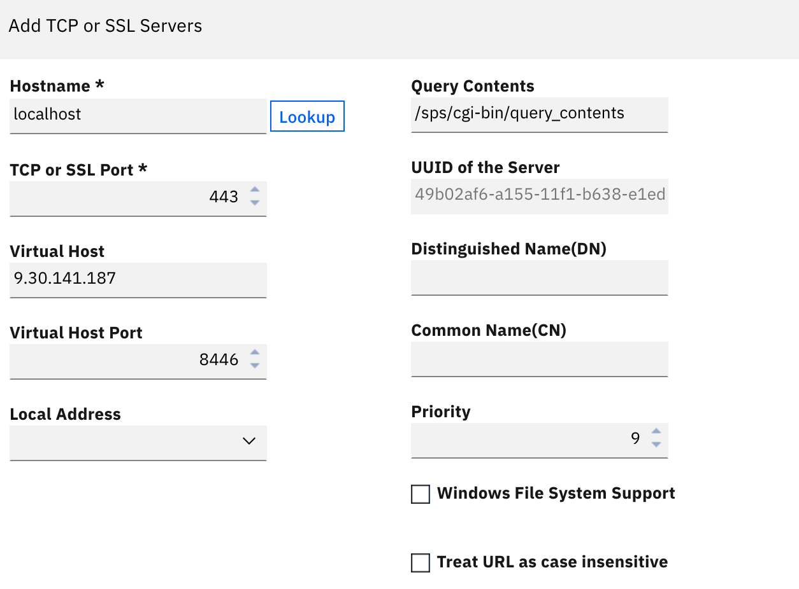

# Troubleshooting

Each entry: what you'd see, why it happens, and the fix. Ordered roughly in
the sequence you're likely to hit them working through setup for the first
time.

---

### `DPWAD1075E` — "authentication failed because the server has not yet been fully initialized"

**Symptom:** OIDC login fails immediately with this error, often right
after initial setup or a config change.

**Cause:** usually one of two things — pending changes not yet deployed on
the OP instance, or the RP's discovery fetch failing at the TLS handshake
because the RP doesn't trust the OP's certificate (see the prerequisite in
[04-rp-setup.md](04-rp-setup.md)).

**Fix:** confirm all changes are deployed and the reverse proxy restarted.
Check `msg__webseald-<instance>.log` for the same timestamp — a `404` from
`AMWJsonClient.cpp` (`DPWAD1064E`) fetching the metadata URL confirms it's
a discovery-fetch problem, not a runtime-not-ready problem. If it's a
discovery fetch failure, check certificate trust first.

---

### Redirect URI doubled up (`.../pkmsoidc/pkmsoidc`, or `https://https://...`)

**Symptom:** `invalid_request` / "Requested redirect_uri does not match
the registered redirect_uri" from the OP, and the redirect URI visible in
the authorize request has a duplicated scheme or path.

**Cause:** `redirect-uri-host` in `[oidc:default]` includes more than just
host and port — a scheme (`https://`) or a path (`/pkmsoidc`). WebSEAL
always builds the final redirect URI as
`https://<redirect-uri-host>/pkmsoidc` — anything extra in the config
value gets prepended/appended on top of that, not replaced.



**Fix:** set `redirect-uri-host` to bare `<host>:<port>`, nothing else.
Confirm the client's registered Redirect URI at the OP matches the
resulting string exactly.

---

### Metadata endpoint returns 404

**Symptom:** `AMWJsonClient.cpp` logs a 404 fetching the discovery
endpoint; `authorization_endpoint` missing errors follow.

**Cause:** the metadata endpoint is scoped per-definition —
`/mga/sps/oauth/oauth20/metadata/<definition-name>` — not a flat, generic
path. A `discovery-endpoint` missing the definition name, or with the name
wrong/unencoded, 404s.

**Fix:** confirm `discovery-endpoint` includes the exact definition name,
URL-encoded if it contains spaces (`%20`). Simpler long-term fix: avoid
spaces in definition names entirely.

---

### `client-secret` doesn't appear in the `[oidc:default]` stanza

**Not a bug.** After the reverse proxy is restarted, WebSEAL obfuscates
`client-secret` and relocates it to the bottom of the stanza. If you're
looking for it to confirm it's set, check the end of the stanza, not
where you originally typed it. The default `webseald.conf` template also
doesn't include a placeholder line for it the way it does for `client-id`
— it's a valid entry that simply needs to be added manually the first
time.

---

### User lands on a generic "login successful" page instead of the originally-requested resource

**Symptom:** login completes successfully (user is authenticated), but
instead of landing on the resource they originally requested, they land
on a generic message page.

**Cause:** the flow was kicked off with a direct link to `/pkmsoidc`
(optionally with a `Target=` query parameter attached), rather than by
letting an unauthenticated user hit the protected resource directly and
get challenged by WebSEAL natively.

These are two different mechanisms, and only one of them produces a
redirect back to the original resource:

- **WebSEAL's native pending-request tracking**, established when an
  unauthenticated request to an actual protected resource triggers a login
  challenge. This is what correctly returns the user to the resource they
  asked for.
- **The `Target` query parameter on `/pkmsoidc`** — this only gets
  forwarded onto the outbound request to the OP (if `allowed-query-arg`
  permits it). It is *not* read back by WebSEAL to construct the final
  redirect, even when present and correctly forwarded end-to-end.

**Fix:** link to the protected resource directly, not to `/pkmsoidc`. See
[04-rp-setup.md](04-rp-setup.md). No `login.html` changes or
`allowed-query-arg` setting are needed for this to work.

This is confirmed, documented IBM behavior, not just something observed
in this lab — see the explanation and IBM engineer quote in
[04-rp-setup.md](04-rp-setup.md).

---

### Login completes at the OP, but nothing happens afterward (no error, browser just stalls)

**Symptom:** the OIDC login form at the OP submits successfully (OP-side
traces show a valid authorization response being issued), but the browser
never lands anywhere — no error, no redirect, just the OP's login page
sitting there as if nothing happened. Reproduces the same way in multiple
browsers (not a single-browser quirk).

**Cause:** the OP's `Content-Security-Policy` response header includes
`form-action 'self'` (present in the stock `[acnt-mgt]` `http-rsp-header`
configuration). Browsers enforce `form-action 'self'` across the *entire*
redirect chain that results from a form submission — not just the form's
immediate action target. Since the OIDC flow's final step is the OP
redirecting the browser back to the RP's `/pkmsoidc` (a different origin),
`form-action 'self'` silently blocks that redirect. Nothing is logged
server-side because, as far as the OP is concerned, it already issued the
redirect successfully — the browser is the one refusing to follow it. A
HAR capture of the login will show the request to the OP succeed with no
corresponding follow-up request to the RP at all.

**Fix:** add each RP's origin to the OP's `form-action` CSP directive.
Find the existing `content-security-policy` line under `[acnt-mgt]`
`http-rsp-header` and add the RP origin(s) to `form-action` rather than
adding a second CSP header (only one is allowed, and it must stay on one
line):

```
http-rsp-header = content-security-policy:TEXT{default-src 'self'; frame-ancestors 'self'; form-action 'self' https://<rp-hostname>:<port>;}
```

List every RP origin that this OP serves, space-separated, inside
`form-action`. Restart the OP reverse proxy instance after saving.

---

### PKCE mismatch

**Symptom:** the OP rejects the authorization request outright with a
PKCE/`code_challenge`-related error, or accepts it when you didn't expect
it to.

**Cause:** `enable-pkce` in `[oidc:default]` doesn't match the client's
**Require PKCE (RFC 7636)** setting on the OP.

**Fix:** set both the same way — both on (recommended) or both off.

---

### 403 on `/pkmsoidc`, resolving under `/mga` instead of the object space root

**Symptom:** a `pdweb.wan.azn` trace shows `/pkmsoidc` being evaluated as
`protected_resource=.../mga/pkmsoidc` rather than at root, and denied.

**Cause:** a **Virtual Host** / **Virtual Host Port** set on the `/mga`
junction's backend server entry. This setting is meant to control how the
junction's *own* content and redirects get rewritten — using it to try to
fix a hostname issue elsewhere has the side effect of pulling `/pkmsoidc`
into the junction's object space, where it inherits the junction's
(much more restrictive) ACL instead of root's.



**Fix:** don't set Virtual Host / Virtual Host Port on the OP's `/mga`
junction. If you're trying to solve a hostname-identity problem, the real
fix is almost certainly the topology issue below — not a junction
setting.

---

### Session/token correlation failure at the final callback (403, or "Moved Temporarily"), despite everything else being configured correctly

**Symptom:** the authorization code is issued correctly, but the RP's
final processing of `/pkmsoidc` fails — either a 403 with no useful detail,
or a "Moved Temporarily" page, even though ACLs, PKCE, `Target`, and the
discovery endpoint are all confirmed correct.

**Cause:** OP and RP are running on the same reverse proxy instance (or
the same instance with two hostname aliases). See
[05-topology.md](05-topology.md) for the full explanation — this is a
session cookie collision between the OP's login challenge and the RP's
pending transaction, not a configuration typo, and no amount of ACL/PKCE/
Target debugging will resolve it.

If you're investigating this from scratch, you may see the OP's runtime
self-identifying as `https://localhost/...` in trace logs
(`getFederationId`, `saveOAuth20Token`) — this is a real artifact of the
runtime's internal request handling, but it's a symptom of the
same-instance topology, not an independently fixable setting. Don't spend
time hunting for an LMI field to change the runtime's self-identified
hostname — the fix is splitting OP and RP onto separate reverse proxy
instances.

**Fix:** move the OP to its own reverse proxy instance, separate from
every RP. See [05-topology.md](05-topology.md).
